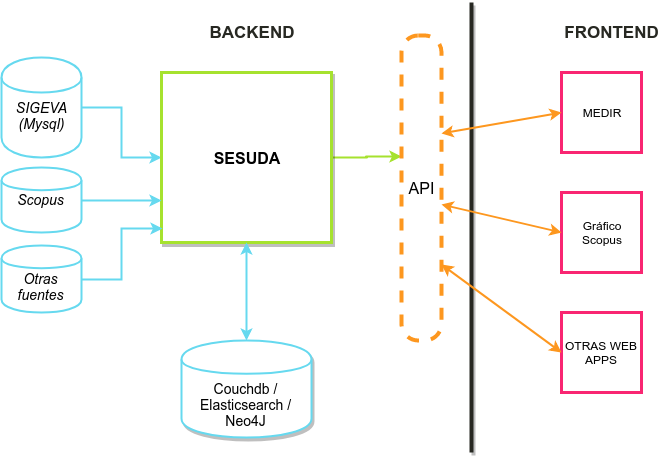

name: inverse
layout: true
class: center, middle, inverse
---
#Estrategias de comunicación
#sobre
#publicaciones científicas.
.footnote[github => [emigpa](https://github.com/emigpa)]
---
layout: false
class: center, middle, inverse

### Antecedentes
## Estructura
## Aplicaciones
## Resultados
---
layout: false
class: middle
.left-column[
# Antecedentes
]
.right-column[
### SIGEVA (Sistema integral de gestión y evaluación)
- Desarrollado por CONICET.
- Modulo Banco de datos.
- Módulo memoria.
- Memoria institucional 2013-2015.

### Problemas
- Datos incompletos.
- Falta de participacion en relevamientos.
]
---
layout: false
class: middle
.left-column[
# Estructura
]
.right-column[

##Backend
###SESUDA (**SE**rvidor **SU**ple **DA**tos)
- NodeJs.
- Docker.
- Mysql / CouchDb (PouchDb) / ElasticSearch / Neo4j.
]
---
layout: false
class: middle
.left-column[
# Estructura
]
.right-column[
## Frontend
### Comunicación Interna (institucional)
- Seguimiento / estado de datos. - MEDIR -

### Comunicación externa (pública)
- Endógena: producida en UNSAM (sigeva, otras áreas). - Círculos producción -
- Exógena: producida fuera de UNSAM, sólo podemos analizarla (Scopus, otras instituciones). - scopus quinquenio -
]
---
template: inverse
## Comunicación Interna (institucional)
---
layout: false
class: middle
.left-column[
# Aplicaciones
## Comunicación Interna (institucional)
### - MEDIR
]
.right-column[

### MEDIR (**ME**morias **DIR**ectorio)
Clasifica y describe la población según el estado de carga de su cv en:
 - Personal en Memoria
 - Personal Relevante
 - Personal Productivo
 - Personal Nulo
 - Personal Fuera de Memoria

### Desarrollado unsando:
 - Vuejs (vuex, vuerouter).
 - Chartjs.
 - Webpack.
]
---
layout: false
class: center, middle
### DEMO: http://emigpa.github.io/medirdemo (login: usuario)
<iframe src="http://emigpa.github.io/medirdemo" width="1000" height="700" frameborder="0"></iframe>
---
template: inverse
## Comunicación externa (pública)
---
.left-column[
# Aplicaciones
## Comunicación Externa (pública)
### - Circulos producción
]
.right-column[
### Círculos producción
Modelo físico que representa las publicaciones científicas de las UUAA.

- Basado en los resultados de la Memoria Institucional 2016.
- Separado por unidad académica.
- Publicaciones científicas.
- Artículos por gran área.

###Desarrollado usando:
- D3js.
- Webpack.
]
---
layout: false
class: center, middle
### DEMO: http://emigpa.github.io/circulosproduccion
<iframe src="http://emigpa.github.io/circulosproduccion" width="1000" height="700" frameborder="0"></iframe>
---
layout: false
.left-column[
# Aplicaciones
## Comunicación Externa (pública)
### - Circulos producción
### - Scopus quinquenio
]
.right-column[
###Scopus quinquenio:
Scatterchart (Gráfico de dispersión) que representa la publicaciones científicas con afiliación UNSAM indexadas por Scopus.
- Datos tomados de Scopus (base de datos de citas y publicaciones científicas en revistas evaluadas por pares).
- Ordenado por cantidad de citas.
- Graficamos un quinquenio.
- Discriminado por area de conocimiento.

###Desarrollado usando:
- Chartjs.
- Vuejs.
- Vuetify.
- Webpack.
]
---
layout: false
class: center, middle
### DEMO: http://sinos.unsam.edu.ar/graficoscopus
<iframe src="http://sinos.unsam.edu.ar/graficoscopus" width="1000" height="700" frameborder="0" scrolling="no"></iframe>
---
layout: false
class: center, middle, inverse

# Resultados
---
layout: false
class: middle
.left-column[
# Resultados
]
.right-column[
- Se sistematizó el relevamiento de datos.
- Hay una continuidad en las políticas de comunicación.
- Se maneja un mismo lenguaje entre UUAA.
- Mejoró la participación de los investigadores.
- Se publican resultados en la web UNSAM.
]
---
layout: false
class: center, middle, inverse

# ¿Preguntas?
---
layout: false
class: center, middle, inverse

# ¡¡¡GRACIAS!!!